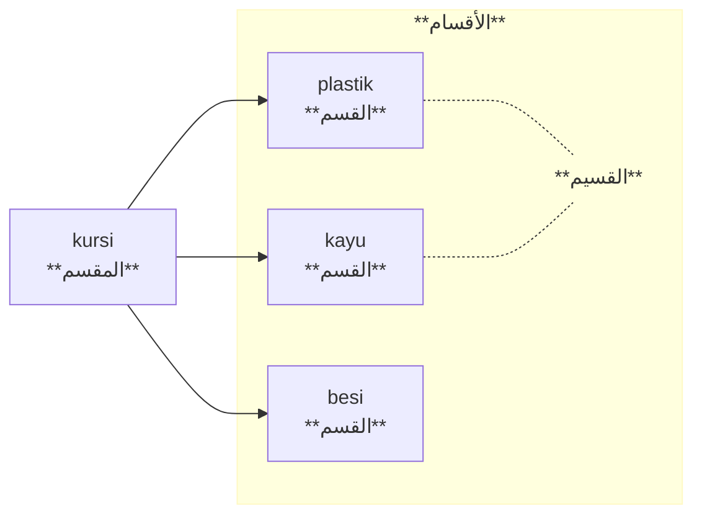

## Perbedaan-Perbedaan Berkaitan Dengan Kulli Dan Juz'i

| Istilah            | Definisi                                                                                                   | Contoh               |
| ------------------ | ---------------------------------------------------------------------------------------------------------- | -------------------- |
| كل Kull         | sesuatu yang dihukumi sebagai sekumpulan المجموع المحكوم عليه                                           | أهل الأزهر علماء     |
| كلي Kulli       | sesuatu yang mengandung makna yang dapat diterapkan pada banyak afrad ما لا يمتنع فرض صدقه على كثيرين   | الإنسان حيوان ناطق   |
| كلية Kulliyyah  | hukum yang diterapkan pada keseluruhan afrad الحكم على كل الأفراد                                       | كل إنسان قابل لفهم   |
| جزء Juz         | sesuatu yang darinya dan dari sesuatu lainnya tersusun sebuah keseluruhan ما تركب منه ومن غيره كل       | السمار والخيط للحصير |
| جزئي Juz'i      | isim yang mengandung makna yang tidak dapat diterapkan pada banyak afrad ما يمتنع صدقه على أفراد كثيرين | زيد                  |
| جزئية Juz'iyyah | hukum yang diterapkan pada sebagian afrad الحكم على بعض الأفراد                                         | بعض الإنسان صادق     |

**Kull atau كل setidaknya memiliki 3 arti:

- Sesuatu yang dihukumi sebagai sekumpulan (jumlah) - "seluruh, sekelompok"
- Sekumpulan yang tidak dapat disederhanakan hukumnya terhadap afrodnya
	- santri putra (keseluruhan tapi satu kelompok satu padu) berhasil mengangkat batu yang besar. “Santri putra” dalam hal mengangkut batu besar tidak dapat direduksi ke afrodnya. Akan keliru ketika kita mengatakan: mas ridwan berhasil mengangkat batu besar.
- Sesuatu yang tersusun dari bagian-bagian. Misalnya: manusia (yang tersusun kepala, kaki, tangan, badan)
	- kepala merupakan bagian atau juz dari manusia
	- manusia merupakan keseluruhan atau kull dari kepala kaki, tangan, badan, dst.

## Taqsim

**Taqsim**: memecah sesuatu menjadi beberapa bagian

Taqsim adakalanya ia berupa :
1. memecah keseluruhan menjadi bagian-bagiannya atau تقسيم الكل إلى أجزائه , atau 
2. pembagian universal terhadap partikular-partikularnya atau تقسيم الكلي إلى جزئياته. 

#### Istilah Penting dalam Taqsim

- مَقسِم sesuatu yang dibagi-bagi
- الأقسام \ قسم bagian-bagian
- قسيم  anggota dari bagian yang sama
- تقسيم tindak pembagian

#### Contoh تقسيم الكل إلى أجزائه

**manusia** (مقسم) dibagi (تقسيم) menjadi beberapa bagian: 

1. kepala (قسم)
2. leher 
3. punggung
4. pinggang
5. dst.

kepala adalah قسيم dari leher

**Kursi** dibagi menjadi beberapa bagian:

1. Paku
2. Kayu
3. Papan

#### Contoh تقسيم الكلي إلى جزئياته

Kata atau الكلمة dibagi menjadi:

1. Isim adalah kalimah
2. Fi'il adalah kalimah
3. Huruf adalah kalimah

Kursi berdasarkan jumlah kaki: 

1. Tiga kaki adalah kursi
2. Empat kaki

Kursi berdasarkan bahan papannya:

1. Plastik
2. Kayu
3. Besi

Di masa Aristoteles, metode taqsim atau klasifikasi dapat digunakan untuk menyusun definisi (taʿrīf). Misalnya, kita akan mendefinisikan gelas. Pertama, lakukan taqsim terlebih dahulu:

Gelas adalah sesuatu. Sesuatu pada umumnya dibagi menjadi:
- tidak dapat menjadi wadah
- yang dapat menjadi wadah {panci, baskom, gelas, teko dsb}
	- berukuran besar
	- berukuran sedang
	- berukuran kecil {gelas, mangkok kecil, botol}
		- tidak digunakan untuk minum
		- digunakan untuk minum {gelas, botol}
			- digenggam
			- dijinjing dengan jari {gelas}
				- yang terbuat dari kaca
				- yang terbuat dari kayu
				- yang terbuat dari plastik

Dengan taqsīm di atas, kita dapat mendefinisikan gelas dengan:

Gelas adalah <u>wadah yang berukuran kecil yang digunakan untuk minum dan dijinjing dengan jari, yang bahannya bisa dari kaca atau kayu atau plastik.</u>
