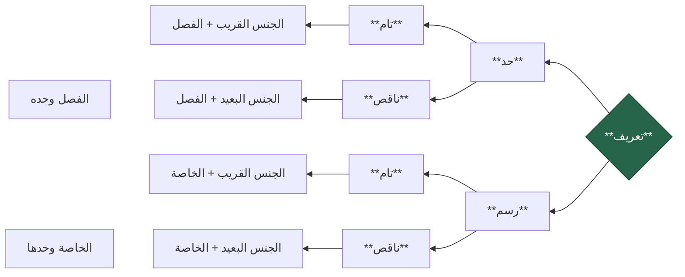

### muʿarrifat / Taʿrīf / Qaul Syarih

Setelah pertemuan sebelumnya kita membahas kulliyyātul khamsah sebagai mabādi' ilmu tashawwur, sekarang kita akan membahas taʿrīf atau definisi sebagai maqāshid dari ilmu tashawwur. Imam al-Damanhuri mendefinisikannya dengan:

> وهو ما كانت معرفته سببًا في معرفة المعرَّف
> 
> Sesuatu yang pengetahuan tentangnya merupakan sebab dari dihasilkannya pengetahuan tentang Muʿarraf.

Contoh:

![[Pasted image 20250208115244.png|654x110]]

Taʿrīf dengan demikian merupakan piranti penting untuk mengetahui sebuah kata (mufrad) dan tashawwur dari kata tersebut.

> [!NOTE] Catatan
> pembahasan tentang [[kulliyatul-khamsah|kulliyātul khamsah]] sangat membantu kita dalam mengidentifikasi dan mengenali suatu hal. Jika suatu hal selalu komposit terdiri dari beberapa unsur esensial, sebuah definisi atau "qaul syarih" akan berusaha memberikan tashawwur yang lengkap yang mencakup beberapa unsur esensial tersebut. Oleh karena itu sebuah definisi yang lengkap pasti berupa murakkab yang terdiri dari jins qarīb dan fashl.

### Pembagian Taʿrīf

Menjelaskan sesuatu dapat dilakukan dengan menyebutnya sifat-sifat yang dapat membedakannya dari sesuatu lainnya. Sifat-sifat ini bisa berupa:

- **sifat** **esensial** (ذاتية) yang mengacu kepada sifat yang mau tidak mau pasti ada pada objek tertentu sehingga dapat membedakannya dari objek lain, yakni **fashl**. Jika demikian, sebuah Taʿrīf dapat dinamakan dengan **Taʿrīf bil Hadd (definisi)**
- **sifat** **non**-**esensial** (عرضية) yang mengacu kepada sifat yang tidak mesti ada pada objek tertentu, tetapi dapat membedakannya dari objek lain, yakni **khasshah**. Jika demikian, Taʿrīf dapat dinamakan **Taʿrīf bir Rasm (deskripsi)**

Baik deskripsi maupun definisi, agar dapat mencapai tingkat kelengkapan, sebuah taʿrīf mesti dijelaskan beserta esensi dasar yang dapat ditempeli sifat tersebut. Dalam taʿrīf الإنسان, untuk dapat mencapai tingkat kelengkapan yang sempurna ia tidak cukup didefinisikan dengan ناطق saja, tetapi juga mesti disertakan esensi dasarnya, yaitu حيوان yang menjadi jins qaribnya.

Dengan demikian setiap definisi dan deskripsi; menjadi lengkap jika ia disertai **1) jins qarīb**, dinamakan dengan **tāmm**; dan menjadi tidak lengkap jika **2) ia disertai hanya dengan jins baʿīdnya atau tidak disertai sama sekali**, dinamakan dengan **nāqish**.

> [!important] Mudahnya!
> menggunakan **fashl** berarti **hadd**
> menggunakan **khassah** berarti **rasm**
>
> menggunakan **jins qarib** berarti **tamm**
> **tidak menggunakannya** berarti **naqish**

Ringkasnya pembagian sebagai berikut:

\* Definisi berangkat dari apa itu manusia (ما هو الإنسان)

- **Hadd Tam**
	- Berupa jins qarib + fashl
		- حيوان [jins qarib] ناطق [fashl]
- **Hadd Naqish**
	- Berupa jins baid + fashl
		- جسم [jinss baid] ناطق [fashl]
	- Berupa fashl saja
		- ناطق [fashl]
- **Rasm Tam**
	- Berupa jins qarib + khassah
		- حيوان [jinss qarib] ضاحك [khassah]
- **Rasm Naqish**
	- Berupa jins baid + khassah
		- جسم [jins baid] ضاحك [khassah]
	- Berupa khassah saja
		- ضاحك [khassah]

Selain definisi dan deskripsi juga terdapat **Taʿrīf bil lafdz**, yaitu sebuah taʿrīf yang menjelaskan sebuah kata dengan padanan kata lainnya (murādif) yang lebih masyhur.

غضنفر = أسد

بشر = إنسان

### Syarat-Syarat Taʿrīf

Berikut adalah syarat-syarat Taʿrīf.

#### 1. Sepadan Dan Mencerminkan Muʿarraf (مطرد ومنعكس)

- (muttharid dan munʿakis). Maksud dari muttharid adalah māniʿ, sedangkan maksud munʿakis adalah jāmiʿ'.
	- Taʿrīf dikatakan muttharid jika taʿrīf itu disebut maka langsung tergambar muʿarrafnya. Sementara dikatakan munʿakis jika taʿrīf itu tidak disebutkan maka muʿarraf tidak tergambar. Contohnya: manusia adalah hewan (JĀMIʿ. mencakup manusia dan bukan manusia) yang berpikir (MĀNIʿ.mengeluarkan: sapi, kuda dst.)
	- *Contoh yang tidak jāmiʿ'* الإنسان شاعر
	- *Contoh yang tidak māniʿ* الإنسان حيوان

#### 2. Jelas (ظاهر)

Taʿrīf tidak lebih samar dari muʿarraf.

#### 3. Bukan Berupa Majaz Tanpa Qarinah (غير مجاز بلا قرينة)

*Contoh salah:* orang bodoh = keledai. *Contoh yang lebih tepat:* orang bodoh = keledai yang dapat menulis

#### 4. Tidak Menghasilkan Daur (لا يحصل الدور)

Pengetahuan tentang muʿarraf tidak bertumpu pada muʿarrif yang hanya bisa diketahui dengan muʿarraf. *Contoh salah:* genap = bukan ganjil, padahal ganjil = bukan genap

#### 5. Bukan Berupa Lafadz Musytarak Tanpa Qarinah (غير مشترك بلا قرينة)

*contoh salah:* matahari = mata
*contoh tepat*: matahari = mata yang bersinar

Disamping syarat tersebut, juga terdapat **tanbihat** terkait Taʿrīf:

1. Taʿrīf tidak tepat jika hanya dijelaskan hukumnya saja. *Contoh salah:* fa'il = isim marfu'. Sebab, hukum bergantung pada ada tidaknya maḥkūm ʿalaih, sedangkan pemahaman tentang muʿarraf bergantung pada pemahaman tentang bagian-bagian dari taʿrīf, maka akan terjadi daur.
2. Taʿrīf tidak tepat jika dibubuhi kata 'atau' yang digunakan bukan untuk taqsīm. *Contoh salah:* orang bodoh = orang yang tidak paham atau tidak bertanya. *Contoh yang benar untuk keperluan taqsim:* Nazhar = proses berpikir yang mengantarkan kepada keyakinan atau zhann. Nah, definisi ini sebenarnya terdiri dari dua taʿrīf:
	1. Nazhar = proses berpikir yang mengantarkan kepada keyakinan
	2. Nazhar = proses berpikir yang mengantarkan kepada zhann

### Kumpulan Contoh:

solat adalah ritual (jins qarib) yang diawali dengan takbir dan diakhir dg salam (fasl)

solat adalah ritual (jins qarib) yang di dalamnya disunnahkan tilawah al-quran (khassah)

الكلام هو اللفظ المركب المفيد بالوضع (HAD TAMM)

اللفظ = suara manusia
المركب = qaul dan jumlah. dikecualikan: mufrad
المفيد = yahsunu sukut alaih. dikecualikan: murakkab idhafi dan murakkab washfi.
بالوضع= dikecualikan: tidak dengan bahasa manusia

الكلام هو المركب المفيد بالوضع (HAD NAQISH)

الكلام اللفظ يمكن السكوت عليه (RASM TAM)

الكلام ما أفاد معنى تاما (RASM NAQIS)

الكلام هو القول (Taʿrīf LAFDZI)

الاسم هو اللفظ الدال على معنى في نفسه غير مقترن بزمن (HAD TAMM)

الاسم هو ما دل على معنى في نفسه غير مقترن بزمن (HAD NAQISH)

الاسم هو اللفظ يقبل دخول "أل" والتنوين (RASM TAM)

الاسم هو ما يقبل دخول "أل" والتنوين (RASM NAQISH)

الاسم ما يدل على شيء (TARIF LAFDZI)

had tamm (muthabaqiyyah) - hadd naqish (tadhammuniyyah) - rasm tam - rasm naqish (iltizamiyyah)

muthabaqiyyah - tadhammuniyyah - iltizamiyyah

- dalalah menunjukkan sesuatu dengan utuh
- dalalah menunjukkan sesuatu dengan sabagiannya
- dalalah menunjukkan sesuatu dengan sifat khariji yang melekat pada sesuatu tersebut

dall (tanda) madlul (sesuatu yang ditandai) dalalah (penandaan)

muarraf = madlul

Taʿrīf = dall

tashawwur = dalalah

Puasa adalah menahan diri dari setiap hal yang membatalkan, dengan niat tertentu sepanjang hari dari hari di mana sah untuk melakukan puasa
- ibadah
- tindakan: menahan diri dari yang membatalkan
- rukun: dengan niat tertentu
- waktu: dari terbitnya matahari sampai terbenam, di hari yang diperbolehkan

Hadd Tamm
- Puasa adalah ibadah menahan diri dari setiap hal yang membatalkan, dengan niat tertentu sepanjang hari di mana sah untuk melakukan puasa
	- ibadah = tindakan manusia dengan niat ubudiyyah; shalat zakat taharah, nikah dst. hanya membedakan puasa dari tindakan selain ibadah
	- menahan diri dari mufatirah ila akhir = puasa. mengecualikan setiap ibadah yang bukan puasa.   membedakan puasa ibadah lain: shalat zakat dst

Had naqish 
- Puasa adalah menahan diri dari setiap hal yang membatalkan, dengan niat tertentu sepanjang hari dari hari di mana sah untuk melakukan puasa
- puasa adalah tindakan menahan diri dengan niat tertentu

Rasm Tam
- puasa adalah Ibadah menyucikan diri 

Rasm Naqish
- puasa adalah menyucikan diri
- puasa adalah tindakan menyucikan diri

tindakan
- amal
	- ibadah
		- fi'liyyah
			- tahaharah
				- dengan air (maiyyah)
					- wudhu
					- mandi
					- izalah
				- dengan bukan air
					- tayammum
					- istinja'
			- puasa
			- zakat
		- qouliyyah
	- muamalah

taharah adalah melakukan sesuatu yang dapat menjadi syarat sah bagi sholat baik dengan air atau tidak

taharah adalah ibadah filiyyah yang menjadi syarat sah bagi shalat baik dengan air atau tidak dengan cara tertentu

Tayammum adalah mendatangkan debu suci kepada wajah dan kedua tangan sebagai ganti dari wudhu dsb, dengan syarat-syarat tertentu (situasi ketiadaan air atau ketidakmampuan bersentuhan air)

Tayammum adalah taharah dengan mendatangkan debu suci kepada wajah dan kedua tangan sebagai ganti dari wudhu dsb, dengan syarat-syarat tertentu (situasi ketiadaan air atau ketidakmampuan bersentuhan air)

- ghairu amal

puasa
- wajib
- sunnah
	- senin-kamis
- haram
	- di hari 1 dhulhijjah
	- dst

