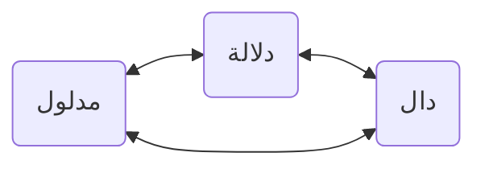
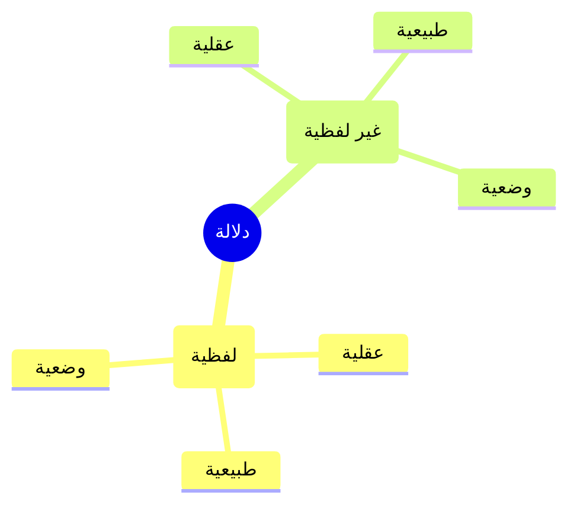
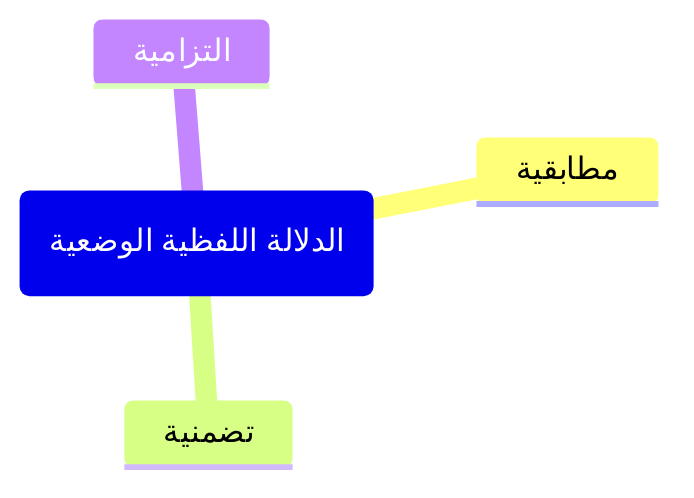
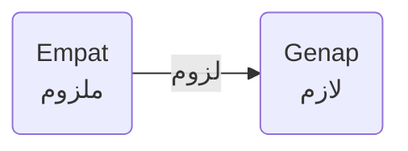

Para ahli mantiq mendefinisikan dalālah sebagai tindak memahami sesuatu berdasarkan sesuatu yang lain

::: {lang=ar-AR}
> فهم أمر من أمر
:::

Sesuatu yang kedua disebut dengan **dāl (penanda)** sedangkan sesuatu yang pertama disebut dengan **madlūl (petanda)**. Tindak memahami hubungan antara keduanya diistilahkan sebagai **dalālah (penandaan)**. Misalnya, dengan kata "Langit" (dāl) kita memahami objek yang ditunjuk oleh kata tersebut (madlūl) yaitu sfera yang luas membentang di atas kita yang tampaknya berwarna biru. 

Contoh lainnya: lampu merah **(dāl)** menunjukkan **(dalālah)** perintah berhenti **(madlūl)**

Namun definisi di atas mengandung kekurangan sebab mengandaikan bahwa penandaan bergantung pada ada tidaknya orang yang memahami. Sedangkan **menurut kelompok lainnya (al-Khubaishi, Qutbuddin ar-Razi, dsb) dalālah itu terkandung dan melekat pada dāl** dan tidak bergantung pada ada tidaknya orang yang memahaminya. Oleh karena itu, kelompok terakhir mendefinisikannya dengan:

::: {lang=ar-AR}
> كون الشيئ بحالة يلزم من العلم به العلم بشيئ اخر
:::

> Adanya sesuatu berdasarkan situasi tertentu (mis. kesepakatan/wadh'), pengetahuan tentang sesuatu tersebut meniscayakan pengetahuan tentang sesuatu yang lain.

Penanda atau dāl dapat berupa lafadz (suara/verbal) dan bukan lafadz. Bisa jadi ia diketahui hanya dengan akal (*maʿqūlah*), atau ia diketahui lewat tabiat manusia (*thabīʿah*), atau ia diketahui lewat kesepakatan atau konvensi (*wadhʿ*). Sumber pengetahuan tentang dāl inilah yang disebut dalam ta'rif dengan situasi atau "*bi ḥālah*". Berdasarkan perbedaan situasi tersebut, dalālah dari aspek penandanya dapat dibagi menjadi:

**dalālah lafdhiyyah (verbal/suara)**

1\. **Thabīʿiyyah**: suara "Ah" menunjukkan adanya reaksi kesakitan

2\. **ʿAqliyyah**: adanya pembicaraan di balik dinding menunjukkan terdapat beberapa orang di sana

3\. **Wadhʿiyyah**: lafadz "Manusia" menunjukkan konsep hewan berpikir

**dalālah ghairu lafdziyyah (non-verbal)**

1\. **Thabīʿiyyah**: pipi merah menunjukkan rasa malu, wajah pucat menunjukkan rasa takut

2\. **ʿAqliyyah**: asap menandakan adanya api, bangunan menunjukkan adanya orang yang membangunnya

3\. **Wadhʿiyyah**: mengangguk menunjukkan persetujuan, lampu merah menandakan berhenti.

Dalālah yang dikaji di dalam ilmu mantiq adalah dalālah lafdzhiyah wadh’iyyah. Terdapat beberapa alasan *mengapa hanya dalālah lafdziyah wadh'iyyah*:

- seandainya dalālah tidak berupa lafadz, atau ia berupa lafadz namun aspeknya *thabīʿah* atau *ʿaqliyyah*, maka madlūlnya akan bersifat acak dan tak pasti, sebab fitrah dan akal manusia yang beragam dan berbeda satu sama lain. 
- dalālah lafdziyyah wadhʿiyyah dalam hal ini bahasa, adalah piranti sosial paling dasar yang digunakan manusia untuk mengkomunikasikan pengetahuannya.

## Pembagian Dalālah Wadh'iyyah

dalālah lafdziyyah wadhʿiyyah dibagi menjadi 3:

1\. **muthābaqiyyah**

lafadz menunjukkan kesesuaiannya dengan makna utuhnya. Contoh: “Manusia” menunjukkan keseluruhan dari konsep ‘ḥayawān nāthiq’.

2\. **Tadhammuniyyah**

lafadz menunjukkan hanya sebagian maknanya. Contoh: “Rumah” dalam “Saya memperbaiki rumah” dapat menunjukkan hanya ke atap atau dinding atau lain sebagainya.

3\. **iltizāmiyyah**

lafadz menunjukkan sesuatu di luar makna lafadz tersebut namun melekat (*lāzim*) padanya. Contoh: kata “Bapak” menunjukkan konsep anak. Angka satu (*malzūm*) menunjukkan konsep ganjil (*lāzim*) yang di luar esensinya namun melekat pada angka tersebut. Hubungan keduanya disebut luzūm.

lāzim *berdasarkan kejelasannya (min ḥaitsul wudhūḥ)* dibagi menjadi:

1. **Bayyin-khusus**: begitu sebuah kata dipahami, kita dapat memahami secara langsung sesuatu lain yang menjadi lāzimnya. Contoh angka “4” menunjukkan genap. “Bapak” menunjukkan anak. (*Inilah yang disepakati ahli mantiq sebagai dāl yang memiliki dalālah iltizāmiyyah.*)

2. **Bayyin-umum**: begitu sebuah kata dipahami, ia masih membutuhkan tasawwur lāzim dan malzūm agar keterhubungan antara keduanya (luzūm) dapat diketahui. Contoh: kata “Manusia” menunjukkan kapasitasnya menerima ilmu.
3. **Ghairul Bayyin**: keterhubungan antara lāzim dan malzūm hanya dapat dipahami melalui perantaraan yang lebih rumit (seperti argumen, qiyas, deduksi, abduksi, dsb). Contoh: “Alam” menunjukkan kehudutsannya (yang mesti dipahami dulu melalui qiyas).

lāzim *berdasarkan mahal (min ḥaitsu maḥallihi)* dibagi menjadi:

- **Dzihnī**: keterhubungan lāzim dan malzūm hanya ada di pikiran, bukan di kenyataan. Contoh: "buta" menunjukkan "melihat".
- **Khārijī**: keterhubungan keduanya hanya ada di kenyataan bukan di pikiran. Contoh: "gagak" menunjukkan "hitam".
- **Dzihnī wa khārijī**: keterhubungan keduanya ada di kenyataan dan di pikiran sekaligus. Contoh: "gunung" menunjukkan "lereng".

## Hubungan Talazum di antara Dalālah

| Hubungan                                                               | Penjelasan                                                                                                                                                                                                                                                                                             |
| ---------------------------------------------------------------------- | ------------------------------------------------------------------------------------------------------------------------------------------------------------------------------------------------------------------------------------------------------------------------------------------------------ |
| dalālah iltizāmiyyah selalu mengandaikan dalālah muthābaqiyyah.         | Sebab sebuah lāzim dari sebuah kata mesti mengandaikan dalālah muthābaqiyyah yang menunjukkan makna utuh dari kata tersebut. Mis. Ketika mengatakan "Ganjil" langsung menandakan angka 1 dalam keutuhan maknanya                                                                                       |
| dalālah tadhammuniyyah selalu mengandaikan dalālah muthābaqiyyah.       | Sebab makna sebagian dari suatu kata mesti mengandaikan adanya dalālah muthābaqiyyah yang menunjukkan keutuhan makna dari kata tersebut. Mis. kata "manusia" mengandung makna sebagian berupa berpikir, tetapi ia juga sekaligus mengandaikan adanya makna yang utuh dari manusia sebagai keseluruhan. |
| dalālah muthābaqiyyah belum tentu mengandaikan dalālah iltizāmiyyah.    | Sebab sebuah kata dalam arti utuhnya belum tentu mengandaikan dalālah iltizāmiyyah yang menandakan lāzim dari kata tersebut, mis. beberapa kata yang luzūmnya masih belum bisa dijelaskan.                                                                                                             |
| dalālah muthābaqiyyah belum tentu mengandaikan dalālah tadhammuniyyah.  | Sebab sebuah kata dalam arti utuhnya belum tentu mengandaikan adanya dalālah tadhammuniyyah yang menandakan bagian-bagian dari makna itu, mis. Kata "atom" sebagai makna utuh, tidak dapat dibagi menjadi beberapa bagian makna lagi.                                                                  |
| dalālah iltizāmiyyah belum tentu mengandaikan dalālah tadhammuniyyah.   | Sebab sebuah kata yang menunjukkan lāzimnya belum tentu mengandaikan dalālah tadhammuniyyah yang menandakan sebagian maknanya. Mis. makna membakar yang menjadi lāzim bagi api, belum tentu menandakan panas yang menjadi bagian substansial dari api.                                                 |
| dalālah tadhammuniyyah belum tentu talazum dengan dalālah iltizāmiyyah. | Sebab sebuah kata yang menunjukkan sebagian maknanya belum tentu mengandaikan dalālah ltizamiyyah yang menandakan lāzimnya.                                                                                                                                                                            |
