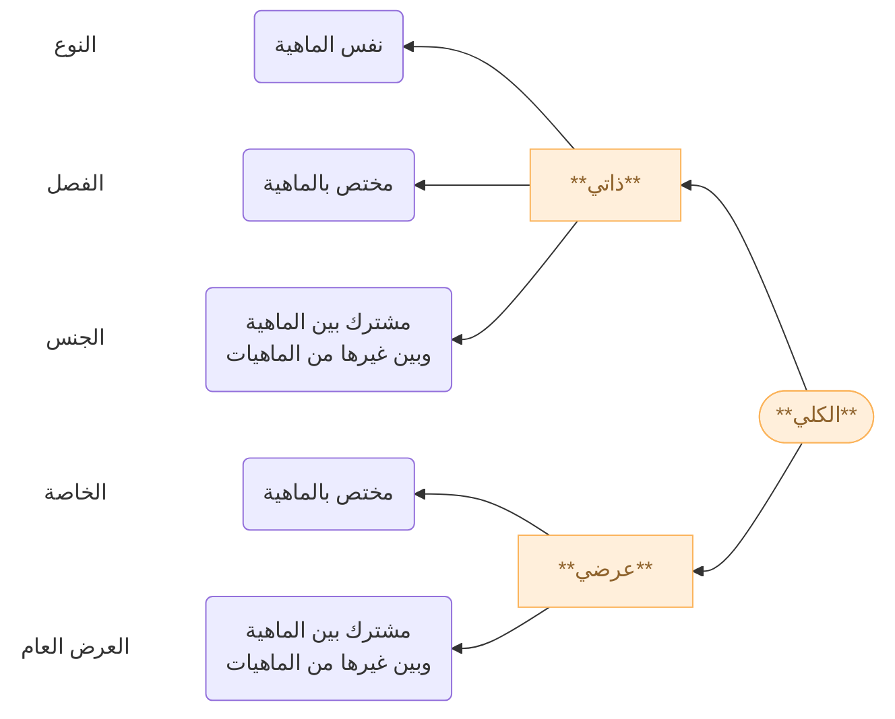

---
aliases:
  - kulliyah khamsah
  - five predicables
title: 05 Kulliyyatul Khamsah
description:
permalink: kulliyat-khamsah
tags:
  - tashawwur
  - kulli
socialImage:
socialDescription:
date: 2026-07-14
publish: true
---

Untuk bagan pembagian kulliyyatul khamsah, dapat dilihat di sini: [[Kulliyat Khomsah.canvas|Skema]]

## Istilah Penting

**Dzāt (الذات)** merujuk pada substansi esensial suatu benda yang membuatnya menjadi dirinya sendiri.

**ʿAradh (عرض)** adalah sifat atau karakteristik yang tidak esensial bagi suatu benda atau konsep. Aradh dapat berubah atau hilang tanpa mengubah identitas dasar benda tersebut.

> Bolpoin adalah benda yang dapat mengeluarkan tinta lewat bola kecil yang bergulir di atas kertas atau medium lainnya

bolpoin adalah benda untuk menulis (*sebagai dzāt*)
bolpoin berwarna biru (*sebagai ʿaradh*)

Māhiyah (ماهية) adalah esensi/hakikat yang menjelaskan "apa itu"  suatu benda.

## Kulliyatul Khamsah

Pada [[pembahasan-tentang-lafadz|bab sebelumnya]], mufrad dibagi menjadi dua:

1. Juz'ī 
2. Kullī 

Kullī adakalanya terkandung atau sama dengan māhiyyah, disebut juga dengan **kullī dzāti**, dan adakalanya berada di luar māhiyah atau disebut juga dengan **kullī ʿaradhi**. Dari keduanya, kullī kemudian dibagi lagi hingga berjumlah lima (kulli dzāti berjumlah 3, kullī ʿaradhi berjumlah 2) . Sejumlah kullī ini, oleh karena itu, dinamai oleh ahli mantiq dengan al-kulliyāt al-khamsah / الكليات الخمسة.

## Kullī Dzātī

### Juz'ul Māhiyah (bagian dari esensi)

Yang menjadi bagian dari esensi terdapat dua kategori kulli:
1. jins
2. fashl

> [!NOTE] Contoh
> manusia (nauʿ) = hewan (jins = {kucing, anjing, kuda, sapi, kambing dst}) yang berpikir (fashl {manusia}) 
> 
> apakah itu zaid? adalah manusia (nauʿ)
> 
> apakah itu manusia (nauʿ)? hewan (jins)  yang berpikir (fashl) yang berjalan (aradh amm) yang tertawa (khassah)
> 
> jins dapat menjawab "apakah itu manusia (nauʿ)?"
> fashl dapat menjawab "yang manakah manusia dari setiap hewan yang ada?" "ayyu syai'"
> nauʿ dapat mejawab "apakah itu zaid (juz'i)"

| سؤال                       | السؤال                          | الجواب           |
| -------------------------- | ------------------------------- | ---------------- |
| عن جزئي                    | ما هو محمد؟                     | النوع: إنسان     |
| عن جزئي حقيقي واحد أو أكثر | ما هو محمد و يوسف و أحمد؟       | النوع: إنسان     |
| عن حقيقة كلي واحد          | ما هو الإنسان؟                  | الحد: حيوان ناطق |
| عن حقيقة كلي وجزئي         | ما هو بكر و الفرس؟              | الجنس: حيوان     |
| عن حقيقة كليين وأكثر       | ما هو الإنسان و الفرس؟          | الجنس: حيوان     |
| المميز الذاتي              | أي شيء هو يميز الإنسان في ذاته؟ | الفصل: ناطق      |
| المميز العرضي              | أي شيء هو يميز الإنسان في عرضه؟ | الخاصة: ضاحك     |

#### Jins (genus)

kullī yang dapat diterapkan pada banyak objek yang berbeda-beda esensinya dalam menjawab pertanyaan "Apakah itu?" contoh : حيوان

1. **Qarib**: di bawahnya hanya terdapat anwa' sementara di atasnya terdapat banyak kulli. Mis. Hewan 
2. **Baid**: di atasnya tidak ada kulli lagi sementara dibawahnya terdapat banyak kulli. Mis. Jawhar
3. **Mutawassith**: di bawah dan atasnya terdapat banyak kulli. 

> [!quote] وهو الكلي المقول على كثيرين مختلفين بالحقيقة في جواب (ما هو)؛ كحيوان

#### Fashl (difference)

kulli yang menjelaskan sifat pada esensi objek tertentu dalam menjawab pertanyaan "yang manakah yang menjadi esensi dari objek tersebut?" contoh: ناطق

1. **Qarib**: sifat yang membedakan esensi satu objek dengan objek lainnya yang berada dalam satu jins qarib yang sama
2. **Baid**: sifat yang membedakan esensi satu objek dengan objek lainnya yang berada dalam satu jins ab'ad yang sama

> [!quote] وهو جزء الماهية الصادق عليها في جواب (أي شيء) هو المميز لهاعن غيرها؛ كالناطق

Fashl juga dibagi aspeknya menjadi:

1. muqawwim: sifat yang menopang sebuah esensi sesuatu. Contoh: berakal bagi manusia 
2. muqassim: sifat yang membagi sebuah esensi sesuatu. Contoh: berakal bagi hewan

### Tamamul Mahiyyah (keutuhan esensi)

#### Nauʿ (species)

kulli yang dapat diterapkan pada banyak objek yang sesuai dengan esensinya dalam menjawab pertanyaan "Apakah itu". Nauʿ haqiqi contohnya: الإنسان. Nauʿ haqiqi adalah kulli yang di bawahnya hanya ada juz'i-juz'i. Sedangkan nau' idhafi dibagi menjadi:

   1. **Qarib**: di bawahnya tidak ada nau' lagi dan di atasnya terdapat bannauʿnauʿ lain. Mis. Manusia
  2. **Baid**: di atasnya hanya ada jins baid dan di bawahnya terdapat banyak nauʿ. Mis. Jism
   3. Mutawassith: di atas dan bawahnya terdapat banyak nauʿ. Mis. hewan

Ketiga pembagian ini bersifat idhafi karena mempertimbangkan bentuk silsilah dan posisi relatif nauʿnya.  

 > [!quote] وهو الكلي المقول على كثيرين متحدين في الحقيقة في جواب (ما هو) كإنسان

## Kulli Aradhi

### Kharij an Al-mahiyah (di Luar esensi)

#### Khassah (proprium)

kulli yang dapat diterapkan pada banyak objek pada esensi tertentu saja, namun ia di luar esensi tersebut

1. Nauʿiyyah (yang terdapat pada nauʿ) mis. Tertawa
2. Jinsiyyah (yang terdapat pada jenis) mis. Berjalan

> [!quote] وهو الكلي الخارج عن الماهية الخاص بها 

berdasarkan melekat atau tidaknya sebuah khassah terhadap keseluruhan esensi, khassah dibagi menjadi:

1. Lazim (yang melekat) mis. tertawa secara quwwah
2. Mufariq (yang tak melekat) mis. tertawa secara fi'il

#### Aradh Amm (accident)

kulli yang dapat diterapkan pada  banyak objek dengan esensi yang berbeda-beda, namun di luar esensi tersebut

1. Lazim (yang melekat) mis. Bernafas secara quwwah
2. Mufariq (yang tak melekat) mis. Bernafas secara fi'il

> [!quote] وهو الكلي الخارج عن الماهية الصادق عليها وعلى غيرها

| تعريف       | كلي                                                               |
| ----------- | ----------------------------------------------------------------- |
| **جنس**     | الكلي / المقول / على كثيرين / مختلفين بالحقيقة / في جواب (ما هو)  |
| **نوع**     | الكلي / المقول / على كثيرين / متحدين في الحقيقة / في جواب (ما هو) |
| **فصل**     | الكلي / الذي يحمل على الشيئ / في جواب أي شيئ / في جوهره           |
| **خاصة**    | الكلي / الخارج عن الماهية / الخاص بها                             |
| **عرض** عام | الكلي / الخارج عن الماهية / الصادق عليها وعلى غيرها               |

## Peragaan

Kita akan memulainya dengan membedah sebuah definisi dari persegi sama sisi. Apakah itu persegi sama sisi?

> **Persegi sama sisi** adalah **bangun datar** yang **dikelilingi oleh empat garis lurus yang sama panjang dan tegak lurus.**

"Persegi sama sisi" dalam definisi di atas adalah **nau**', yaitu kulli yang dapat diterapkan pada banyak afrod dan **persis** sebagaimana esensi yang dipahami dari definisi di atas, tak kurang dan tak lebih.

"Bangun datar" adalah **jins**, kulli yang dapat diterapkan pada banyak afrad tapi menjadi **bagian dari** esensi persegi. Ia dapat mencakup bangun datar selain persegi sama sisi. Bangun datar = {persegi panjang, lingkaran, trapesium, segitiga, heksagon, pentagon, dll}

Sedangkan "Yang dikelilingi oleh empat garis lurus yang sama panjang dan tegak lurus" adalah **fashl**, sifat yang dapat diterapkan hanya pada afrad persegi sama sisi saja dan termasuk bagian dari esensinya. Ia tidak dapat diterapkan pada lingkaran ataupun persegi panjang.

Jika kita mensifati persegi sama sisi dengan:

> (1) diagonal-diagonalnya sama panjang, tegak lurus, dan saling membagi dua 

Atau,

> (2) jumlah sudut-sudut luarnya sama dengan empat sudut siku-siku (360°).

Baik sifat (1) maupun sifat (2) sama-sama ada di luar esensi "persegi sama sisi". Kedua sifat tersebut bukan menjadi bagian pembentuk dari "persegi sama sisi". Pada (1) ia adalah sifat yang khusus ada pada persegi sama sisi, oleh karena itu disebut **khassah**, sedangkan yang (2) adalah sifat yang mencakup baik "Persegi sama sisi" maupun "Bangun datar" lainnya, oleh karena itu disebut **aradh amm**

