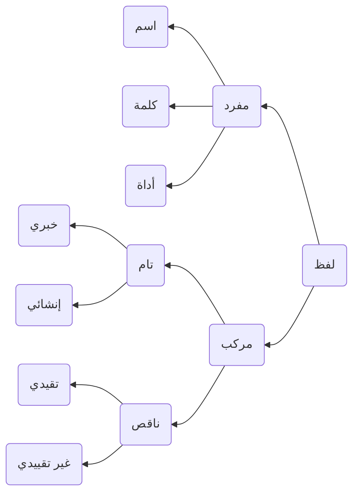
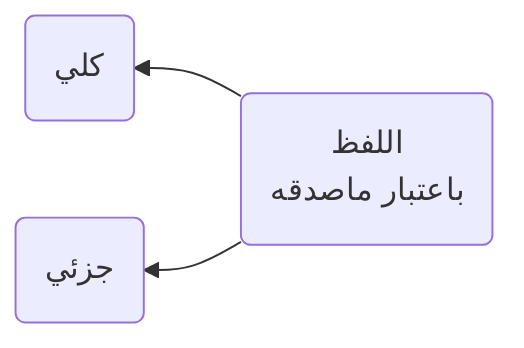
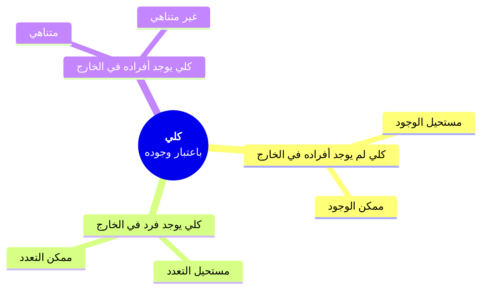

> [!cite]  إخوان الصفا
> إن المعاني والأفكار كالأرواح، والألفاظ كالأجساد لها، وذلك أن كل لفظة لا معنى لها هي كجسد لا روح فيه، وكل معنى في النفس لا لفظ له، هو بمنزلة روح لا جسد له

Zaid berdiri = keseluruhan makna
- zaid = makna zaid sebagai fail
- berdiri = makna sebagai predikat

zaid = ز

Secara umum lafadz dibagi menjadi dua:

1. Muhmal: Lafadz yang tidak memiliki makna. Oleh karena itu tidak akan dibahas di dalam ilmu mantiq.
2. Musta'mal: Lafadz yang memiliki makna, inilah yang nanti akan dibahas. 

Lafadz musta'mal kemudian dibagi menjadi dua, mufrod dan murakkab .

**Mufrad** (atau disebut juga oleh ahli mantiq sebagai **hadd**) merupakan lafadz yang sebagiannya tidak menunjukkan sebagian maknanya.

Pengertian ini mencakup beberapa lafadz yang:

- Tidak dapat dibagi-bagi lagi. Mis. Hamzah istifham (أ) (ب)
- Memiliki bagian namun tak bermakna. Mis. Zaid: ز tidak memiliki makna, begitu juga ي dan د yang menyusunnya
- Memiliki bagian yang menunjukkan makna, namun bukan bagian dari makna keseluruhan. Mis. Abdullah: عبد memiliki makna "Hamba" namun tidak menjadi bagian dari makna keseluruhan, yaitu sebuah nama atau علم yang disandang oleh seseorang tertentu.
- Memiliki bagian yang menunjukkan makna dan menjadi bagian dari makna keseluruhan, namun tidak dimaksudkan dalam konteks penandaannya. Mis. حيوان ناطق yang digunakan sebagai panggilan atau لقب.

manusia adalah hewan yang berpikir. "hewan yang berpikir" telah dipahami ribuan tahun oleh generasi manusia terdahulu.

**Murakkab** (atau disebut juga dengan **qaul**) adalah Lafadz yang sebagiannya menunjukkan sebagian maknanya.

#### Pembagian Mufrad

> [!cite] الكاتبي في شرح الشمسية عن أقسام المفرد 
> وهو إن لم يصلح للإخبار به وحده فهو الأداة كـ " في " و "لا" وإن صلح لذلك، فإن دل بهيئته على زمان معين من الأزمنة الثلاثة، فهو الكلمة، وإن لم يدل، فهو الاسم

**Isim**: lafadz yang memiliki makna secara mandiri, tidak terikat dengan waktu, dan dapat diletakkan sebagai mahmul dan maudhu. 

Maudhu' = subjek atau musnad ilaih

Mahmul = predikat atau musnad

*contoh* زيد قائم . 
زيد = maudhu 
قائم = mahmul 

**Kalimah**: lafadz yang memiliki makna secara mandiri dan terikat dengan waktu. Ta'rif yang lebih komprehensif: lafadz yang maddahnya (sekumpulan hurufnya) menunjukkan makna sedangkan hai'ahnya (bentuknya) menunjukkan waktu. Kalimah hanya dapat diletakkan sebagai mahmul. *contoh* نصر، قام، ذهب

**Adat**: lafadz yang tidak memiliki makna mandiri pada dirinya sendiri dan tidak dapat diletakkan sebagai mahmul maupun maudhu. *contoh* من، إلى، على

#### Pembagian Murakkab

Murakkab dibagi menjadi dua: murakkab tam dan murakkab naqish.

**Murakkab tam (susunan sempurna)** adalah susunan mufrod yang membentuk makna utuh tanpa mesti ada penambahan kata lain. Contoh:

| زيد           | قائم          |
| ------------- | ------------- |
| Maudhu (isim) | Mahmul (isim) |

Murakkab tam dibagi menjadi:

**Khabar** yang mengandung benar dan salah pada dirinya sendiri (disebut juga oleh ahli mantiq dengan **qadhiyah**)

"Pada dirinya sendiri" berarti terlepas dari kesesuaiannya dengan kenyataan atau tidak

**Insya**' yang tidak mengandung benar dan salah berupa: 
- Amar
- Nahy
- Istifham
- Tamanni
- Nida'

Murakkab naqish (tak sempurna) adalah susunan mufrod yang belum membentuk makna utuh sehingga membutuhkan penambahan lafadz lain.

| عن   | زيد  | ... |
| ---- | ---- | --- |
| Adat | isim | ... |

Dibagi menjadi:

- Taqyidi, ketika bagian yang kedua merupakan shifat atau mudhaf ilaih dari yang pertama. 
	زيد العارف
	كريم الوجه
	
- Ghairu taqyidi, ketika tersusun dari isim dan adat atau kalimah dan adat.
	من المدرسة
	يحكى عنه

### Pembagian Mufrod

Mufrod dibagi menjadi dua, juz'i dan kulli

**juz'i** (partikular) adalah isim yang mengandung makna yang tidak dapat diterapkan pada banyak objek. Mis. Zaid, muhammad, allah. Zaid: {zaid}, singa ini

ما يمتنع صدقه على أفراد كثيرين

**kulli** (universal) adalah Isim yang mengandung makna yang dapat diterapkan pada banyak objek. Mis. Manusia. Manusia: {zaid, muhammad, bakar, umar, dll}

ما لا يمتنع فرض صدقه على كثيرين

> Adapun fi'il, maka ia selalu berupa kulli karena mengandung makna (yaitu tindakan / hadats) yang dapat diterapkan pada banyak objek.

### Mafhum Dan Mashadaq

**Mafhum** (intensi/konotasi) adalah sifat, kumpulan sifat, dan makna mental yang ditunjukkan oleh lafadz tertentu.

Semisal: lafadz manusia berarti "Hewan yang berpikir". Mafhum dari lafadz manusia adalah sifat kehewanan dan pikiran yang dilekatkan pada semua afrad manusia. 

**Mashadaq** (ekstensi/denotasi) adalah afrad yang diacu oleh lafadz berdasarkan mafhum tertentu.

Berdasarkan mafhum hewan yang berpikir, maka mashadaq manusia mencakup {zaid, muhammad, bakar, umar, dll}

> [!important] catatan
> **mafhum** manusia = hewan yang berpikir
> **mashadaq** manusia = {khalid, zaid, muhammad, bakar, umar, chairil anwar, sapardi, aan mansyur, dll}
> 
> semakin banyak mafhumnya maka semakin sedikit mashadaqnya. 
> Misal: manusia kita tambahkan sifat penyair menjadi; 
> 
> **mafhum** manusia penyair = hewan yang berpikir yang memiliki bakat bersyair
> **mashadaq** manusia penyair = {chairil anwar, sapardi, aan mansyur, dll, namun khalid dan bakar belum tentu penyair}

#### Berdasarkan Keberadaannya, Kulli Dibagi Menjadi:

1. Kulli yang afrodnya tidak ditemukan di kenyataan
	1. Mustahil maujud. Mis. Berkumpulnya dua hal yang bertentangan
	2. Jawaz maujud. Mis. Lautan khamr, gunung emas
2. Kulli yang ditemukan satu afrad saja
	1. Mustahil ta'addud. Mis. Allah
	2. Jawaz ta'addud. Mis. Matahari
4. Kulli yang ditemukan seluruh afradnya
	1. Terbatas. Mis. Manusia
	2. Tak terbatas. Mis. Kesempurnaan Allah

> [!IMPORTANT] Faidah
> Jika lafadz dan makna itu dua aspek dari sebuah kata, maka pensifatan lafadz dengan mufrod dan murakkab adalah sifat yang hakiki (yang sebenarnya) sedangkan pensifatan makna dengan mufrad dan murakkab adalah sifat yang majazi (bukan sebenarnya).
> 
> Sebaliknya, pensifatan makna dengan kulliyah dan juz'iyyah adalah sifat yang hakiki (yang sebenarnya), sedangkan pensifatan lafadz dengan kulliyah dan juz'iyyah adalah sifat yang majazi (bukan sebenarnya).

kata
- lafadz
- makna

lafadz mufrod atau lafadz murakkab (hakiki)
makna mufrod atau makna murokkab (majazi)

zaid → mufrod → huruf zain, ya', dal

Zaid → makna mufrod 

zaid yang tampan → murakkab (lafadz)
- zaid
- tampan

→ mufrod (makna)
zaid

Manusia adalah **hewan yang berpikir**

- lafdzi murakkab
- maknawi → mufrod