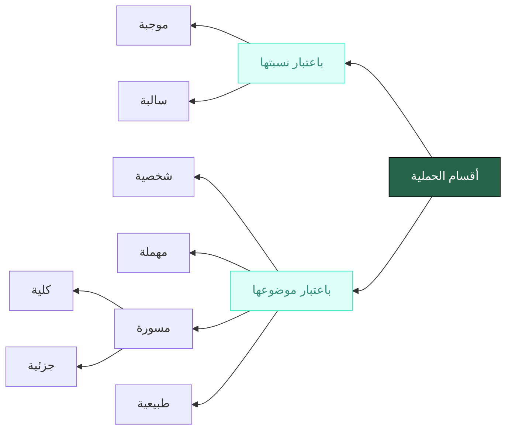

Bab qadhiyyah adalah pembahasan yang paling dasar untuk memahami jantung dari kajian  ilmu mantiq, yaitu qiyās. 

> [!quote]
> مركب احتمل الصدق والكذب لذاته. 
> 
> **Definisi qadhiyyah:** qaul tersusun yang dapat dinilai benar dan salah pada dirinya sendiri.

Definisi di atas berarti mengecualikan:

- qaul yang berupa mufrad. (lihat kembali perbedaan antara mufrad dan murakkab di [[pembahasan-tentang-lafadz|pembahasan Lafadz]])
- setiap qaul yang tidak dapat dinilai benar dan salahnya, seperti insyā’ dan thalab.

Definisi di atas juga berlaku ke semua pernyataan terlepas apakah pernyataan itu benar atau salah karena di luar dirinya sendiri. Misalnya, pernyataan itu benar karena telah difirmankan Allah atau pernyataan itu salah karena disampaikan oleh Musailamah al-Kaddzab. 

Qadhiyyah terdiri dari dua unsur yang saling dinisbatkan. Adakalanya 1) nisbat berupa pelekatan (*ḥaml*) dan 2) adakalanya nisbat berupa talazum atau pertentangan (*ʿinād*). Berdasarkan nisbat ini, qadhiyyah dibagi menjadi:

1) ḥamliyyah (proposisi kategoris)
2) syarthiyyah (proposisi kondisional)
	1) Muttashilah (konjungtif)
	2) Munfashilah (disjungtif)

Contoh qadhiyyah ḥamliyyah:

| **زيد** | **هو**                          | **كاتب** |
| ------- | ------------------------------- | -------- |
| موضوع   | رابطة *عبارة عن* النسبة الحكمية | المحمول  |

Contoh qadhiyyah syarthiyyah:

| **إن**                                 | **كانت الشمس طالعة،** | **فـ**                                 | **النهار موجود** |
| -------------------------------------- | --------------------- | -------------------------------------- | ---------------- |
| اداة الشرط *عبارة عن* النسبة التلازمية | المقدم                | اداة الشرط *عبارة عن* النسبة التلازمية | التالي           |

| **والعدد إما زوج** | **وإما   **                        | **(هو) فرد** |
| ------------------ | ------------------------------------- | ------------ |
| المقدم             | اداة العناد *عبارة عن* النسبة التنافي | التالي       |

## Qadhiyyah Ḥamliyah (Proposisi Kategoris)

Qadhiyyah hamliyyah adalah qadhiyah yang mengandung maudhūʿ dan maḥmūl.

> [!quote]
> ما اشتملت على موضوع ومحمول ؛ كزيد كاتب، إما أن يكون موضوعها كليا؛ كالإنسان حيوان، أو جزئيا؛ كزيد كاتب.

<!--Contoh: maudhūʿ-copula (predikasi)-maḥmūl
Rabithah:
- zamaniyyah كان
- ghairu zamaniyyah هو

َsusunan qadhiyah:
- tsunaiyyah = maudhūʿ + maḥmūl
- tsulatsiyyah = maudhūʿ + rabithah + maḥmūl
  -->

| **زيد** | **هو**                          | **كاتب** |
| ------- | ------------------------------- | -------- |
| موضوع   | رابطة *عبارة عن* النسبة الحكمية | المحمول  |

| **الذهب** | **هو**                          | **معدن** |
| --------- | ------------------------------- | -------- |
| موضوع     | رابطة *عبارة عن* النسبة الحكمية | المحمول  |

dalam contoh الذهب هو معدن “emas” dihukumi sebagai “logam”, yang berarti emas dilekatkan/dibawai/disandari sifat ke-logam-an padanya. Adapun kata “huwa” berfungsi untuk menjelaskan dan mengekspresikan (*ʿibārah*) nisbat hukum antara “emas” dan “logam”. Dari dua contoh di atas, kita dapat menyimpulkan bahwa qadhiyyah tersusun dari:

1. **maudhūʿ**' (subjek) yaitu “emas” sebagai hal yang diletakkan untuk dibawai sifat tertentu. dalam ilmu Nahwu, maudhūʿ juga disebut dengan *maḥkūm ʿalaih* atau *musnad ilaih*.
2. **Maḥmūl** (predikat) yaitu “logam” sebagai hal yang dibawai/dilekatkan pada maudhūʿ. dalam ilmu Nahwu, maḥmūl juga disebut dengan *maḥkūm bih* atau *musnad*.
3. **Nisbat Hukum** yaitu hubungan antara maudhūʿ dan maḥmūl yang menyatakan ījāb (positif/afirmatif) atau salab (negatif); tetap tidaknya maḥmūl pada maudhūʿ.
4. **Rābithah** (kopula) yaitu ekspresi kebahasaan yang menjelaskan nisbat hukum. Dalam bahasa Arab ia bisa jadi dibuang atau berupa “huwa“ atau adat nafi seperti لاو ليس dsb. Dalam Bahasa Indonesia ia dinyatakan dengan “adalah“, “bukan” dan “tidak”.

> [!tip] Catatan
> Jika rabithah dibuang, maka qadhiyyah hanya terdiri dari maudhūʿ dan maḥmūl, oleh karena itu disebut dengan *Tsuna'iyyah*. Sedangkan jika rabithah diekspresikan, maka qadhiyyah terdiri dari maudhūʿ, maḥmūl, dan rabithah, oleh karena itu disebut dengan *tsulatsiyyah*

Kata “ḥaml” dalam hamliyyah berarti membawa. Dalam ilmu mantiq, **maudhūʿ** adalah lafadz yang **diletakkan** pada qadhiyyah. Sedangkan **maḥmūl** adalah sifat yang **dibawai** di atas maudhūʿ. Maksudnya sifat yang 'dilekatkan' pada maudhūʿ.

> [!tip] Catatan
> Apa yang dimaksudkan dengan maudhūʿ adalah māshadaqnya atau afrād yang diacu olehnya
> 
> Apa yang dimaksudkan dengan maḥmūl adalah mafhumnya atau sifatnya

Ketika kita mengatakan “emas adalah logam”, maka dengan kata lain kita berarti juga:

1. menempelkan sifat kelogaman terhadap emas sebagai objeknya
2. menempelkan mafhum logam terhadap māshadaq emas

Ketika kita mengatakan “manusia adalah hewan”, maka kita juga berarti:

1. menempelkan mafhum hewan pada māshadaq manusia, atau kita bisa merumuskan bahwa manusia yang beranggotakan {zaid, bakar, umar, muhammad dst} dapat disifati dengan hewan
2. mengatakan bahwa sifat hewan itu benar bisa diterapkan pada {zaid, bakar, umar, muhammad dst} (الحيوان كمفهوم صدق على أفراد الإنسان).

jika “Setiap logam dapat menghantarkan panas” itu benar maka benar pula untuk mengatakan bahwa konsep menghantarkan panas berlaku atau dapat diterapkan pada semua afrad logam. Benar pula:

- emas *dapat menghantarkan panas*
- besi *dapat menghantarkan panas*
- kuningan *dapat menghantarkan panas*
- tembaga *dapat menghantarkan panas*

## Pembagian Ḥamliyyah

Berdasarkan maudhūʿnya qadhiyyah ḥamliyyah dibagi menjadi:

1. Syakhsyiyyah (singular)
	1. Jika maudhūʿ qadhiyah berupa juz'i
	2. Contoh: زيد كاتب
2. Muhmalah (tak-tentu)
	1. Jika maudhūʿ berupa kulli namun tanpa sur
	2. Contoh: الإنسان حيوان 
3. musawwarah atau maḥshūrah
	1. Kulliyah (universal)
		1. Jika maudhūʿ berupa kulli dengan ur kullis (مسورة بالسور الكلي)
		2. Contoh: كل إنسان حيوان
	2. Juz'iyyah (partikular)
		1. Jika maudhūʿ berupa kulli dengan sur juz'i (مسورة بالسور الجزئي)
		2. Contoh: بعض الإنسان شاعر

Adapun yang dimaksud sūr (السور / kuantor) adalah lafadz yang menunjukkan **kammiyyah (kuantitas)** afrād maudhūʿ pada sebuah qadhiyyah; apakah keseluruhan atau sebagiannya. Jika keseluruhannya maka qadhiyyah disebut kulliyyah. Jika sebagiannya maka qadhiyyah disebut juz'iyyah.

> [!tip] Catatan
> Sebagian ahli mantiq juga menyebutkan bahwa terdapat macam lain, yaitu qadhiyyah thabīʿiyah. Qadhiyyah thabīʿiyyah membahas maudhūʿ sebagai term-term logika, sebagaimana pernyataan “manusia adalah nau”. Manusia diartikan sebagai kategori logika dan dalam pernyataan tersebut dihukumi sebagai syakhsiyyah.

Masing-masing dari keempat pembagian di atas, dibagi kembali menjadi 1) mūjabah: jika menunjukkan hubungan afirmatif (ījab) antara maudhūʿ dan maḥmūl, dan 2) sālibah: jika menunjukkan hubungan negatif (salab) antara maudhūʿ dan maḥmūl. Kedua modus ijabah ataupun sālibah dinamakan dengan **kayfiyyah (kualitas)** pada sebuah qadhiyyah.

Berdasarkan pembagian yang sudah kita lakukan, maka dihasilkan 8 jenis qadhiyyah ḥamliyah. Yaitu syakhsiyyah mūjabah, syakhsiyyah sālibah, muhmalah mūjabah, muhmalah sālibah, kulliyah mūjabah, kulliyah sālibah, juz'iyyah mūjabah dan juz'iyyah sālibah.

> [!tip] Catatan
> Jika sur menentukan kammiyah sebuah qadhiyyah, ijab/salabnya menentukan kayfiyyah sebuah qadhiyyah.
> 
> كل الإنسان حيوان
> 
> apakah kammiyyahnya? 
> j: Kulliyyah, karena yang diacu oleh manusia adalah keseluruhan afradnya
> apakah kaifiyyahnya?
> j: mūjabah, karena nisbat antara maudhūʿ dan maḥmūlnya adalah ijabi (positif)

Jika kita memperhatikan contoh sālibah di atas, kita dapat menyimpulkan bahwa adat salab menjadi ibarat yang menjelaskan hubungan antara maudhūʿ dan maḥmūl. Ia adalah rabithah. Namun adat salab juga dapat diletakkan pada maudhūʿ ataupun maḥmūl, meskipun **tidak mengubah** pernyataan  mūjabah  menjadi sālibah, atau sebaliknya. Qadhiyyah yang adat salabnya digeser dinamakan qadhiyyah ma'dulah. Sedangkan jika tidak demikian maka dinamakan muhasshalah. Contohnya:

اللاإنسان هو حجر (maʿdūlatul maudhūʿ)
لا شيء مما هو **لا حيوان** بإنسان (qadhiyah ma'dulat maudhūʿ)
كل إنسان هو **لا فرس** (ma'dulat maḥmūl)
كل ما **لا حيوان** هو **لا إنسان** (ma'dulat tharafain)

> [!quote]
> Macam-macam sūr dapat dilihat dari penjelasan berikut ini:
> 
> (١) **السور الكلى فى الإيجاب** وهو كل، وجميع، وعامة، وكافة، وغيرها من كل لفظ يدل على ثبوت المحمول لجيع أفراد الموضوع؛ وذلك نحو كل مثلث يحتوى على ثلاثة أضلاع، جيع المعادن تتمدد بالحرارة، عامةالمصرين محبون أميرهم 
> (٢) **السور الكلى فى السلب** وهو لاشى، ولا واحد، والنكرة فى سياق النفى وغيرها من كل ما يدل على عموم سلب الحكم عن جيع أفراد الموضوع؛ وذلك نحو لاشيء من الجماد بحي، ولا واحد من الطلبة حاضر 
> (٣) **السور الجزئي فى الايجاب** وهو بعض، وواحد، وكثير، وقليل، ومعظم وغيرها من كل لفظ يدل على ثبوت المحمول لبعض أفراد الموضوع فقط ؛ وذلك نحو بعض المثلث قائم الزاوية ، وواحد من الحاضرين يتكلم ، وقليل من المصريين سافر إلى أوربا
> (٤) **السور الجزئى فى السلب** وهو ليس بعض ، وليس كل ، وليس جميع ، وبعض. . . ليس، وما كل ، وغيرها من كل لفظ دل على سلب المحمول عن بعض أفراد الموضوع فقط، وذلك نحو ليس بعض المثلثات بقائم الزاوية ، وليس كل المصريين بمتعلم، وبعض الطلبة ليس منتسبا إلى الأزهر

Dalam bab qiyas nanti, syakhsiyyah dihukumi sebagai kulliyyah, karena ketika menyatakan "zaid memukul" berarti keseluruhan diri zaid yang dihukumi. sedangkan muhmalah dihukumi sebagai juz'iyyah karena hukum belum tentu diterapkan pada keseluruhan. maka di pembahasan qiyas, hanya akan ada 4 qadhiyyah yang dikaji:

1. kulliyyah mūjabah (A)
2. juz'iyyah mūjabah (I)
3. kulliyyah sālibah (E)
4. juz'iyyah sālibah (O)

untuk memudahkan kita dapat mempersingkatnya menjadi simbol (Affirmo dan Nego) secara berurutan menjadi A, I, E, O.

> [!NOTE]
> hubungan antara māshadaq dengan mafhum dalam sebuah qadhiyyah
> 
> *الانسان حيوان*
> mafhum hewan {organisme hidup} → māshadaq manusia {zaid, khalid, muhammad, dst}
> *Santri ppfm Resikan* 
> mafhum resikan {disiplin bebersih diri} → māshadaq santri ppfm {santri kelas diniyah dari idad - dewan asatidz}

